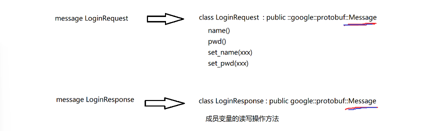
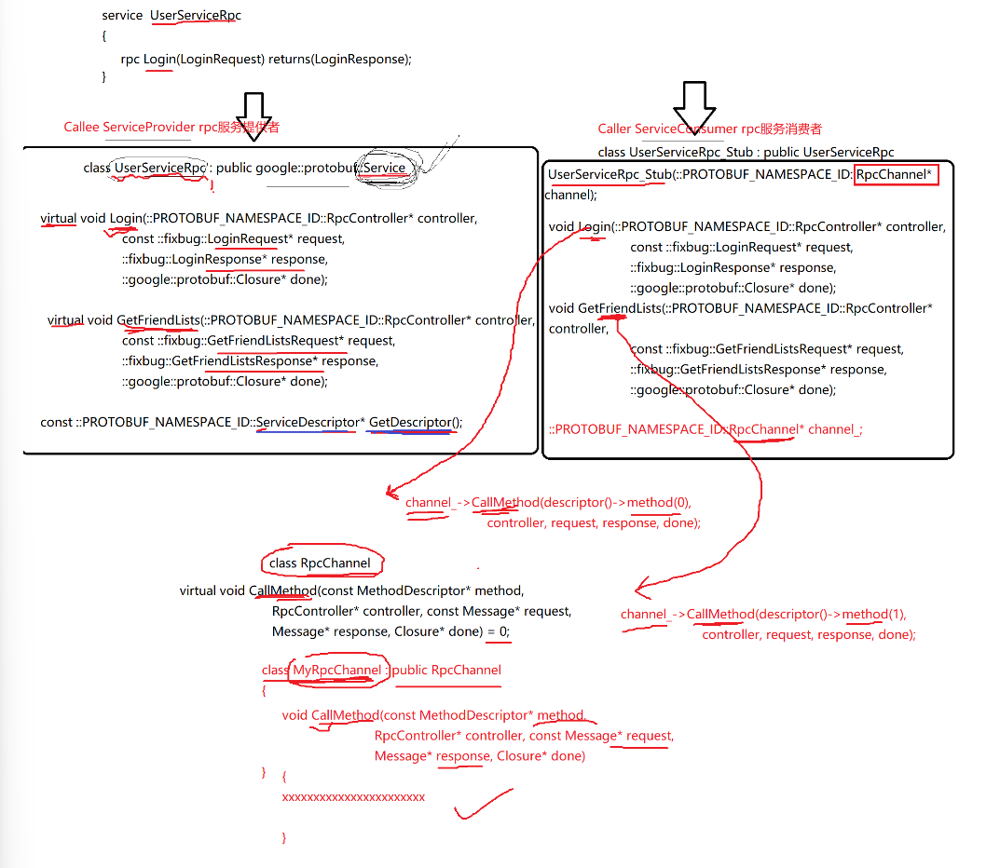
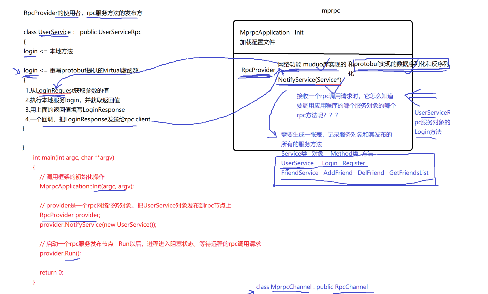
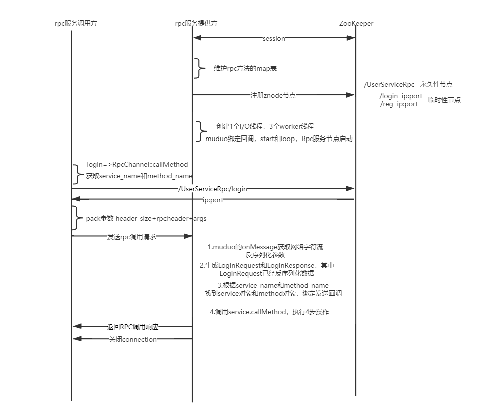

# tiny_rpc
该项目是在学校自己学习的。（The project I did in college.）

# 分布式网络通信框架rpc开发

分布式相比于集群有哪些好处？

聊天系统做了模块化设计，每一个模块都包含很多特定的业务。

单机聊天服务器：

1.受限于硬件资源，聊天服务器所能承受的用户的并发量。

2.任意模块的修改，都会导致整个项目代码重新编译、部署。

3.系统中，有些模块是属于CPU密集型的，有些模块是属于I/0密集型的，造成各模块对于硬件资源的需求是不一样的。

集群连天服务器：每一台服务器都是一套独立的聊天系统。

| 优点               | 缺点                                                       |
| ------------------ | ---------------------------------------------------------- |
| 用户并发量提升了。 | 代码还是需要整体重新编译，而且需要进行多次部署（更差劲）。 |
| 简单！             |                                                            |

分布式：

| 优点                               | 缺点 |
| ---------------------------------- | ---- |
| 并发量提高。                       | 复杂 |
| 模块改动不需要整体重新编译、部署。 |      |
| cpu和io密集型可以分开部署。        |      |

那么：

1.大系统的软件模块该怎么划分？

各模块可能会实现大量重读的代码。

2.各模块之间该怎么访问呢？

机器一上的模块怎么调用机器二上的模块的一个业务方法呢？

机器一上的一个模块进程1如果调用机器一上的模块进程2里面的一个业务方法呢？


序列化和反序列化使用protibuf，protobuf=》json的好处：

1.protobuf是二进制存储的；xml和json都是文本存储的。

2.protobuf不需要存储额外的信息；json和xml需要存储额外信息（key-value存储）。


#### Boost库安装配置

#### muduo库安装配置

#### Protobuf安装配置

#### protobuf的简单使用

**user.proto**

```protobuf
// 定义登录请求消息类型 name pwd
message LoginRequest
{
    bytes name = 1;
    bytes pwd = 2;
    // map<int32,string> test = 3;
}
// 错误类型
message ResultCode
{
    int32 errcode=1;
    bytes errmsg = 2;
}
// 定义登录响应消息类型
message LoginResponse
{
    ResultCode result = 1;
    bool success = 2;
}
```

**protoc user.proto --cpp_out=./**

本质是生成了三个类继承了message类，并且有各种访问(name(),pwd())和设置(set_name(),set_pwd())方法等。



### protobuf的service类

user.proto

```protobuf
//在protobuf里面怎么定义描述rpc方法的类型 - service
service UserServiceRpc
{
    rpc Login(LoginRequest) returns(LoginResponse);
}
```

生成的.h文件为：




## 本地服务怎么发布成rpc服务

### 一

写一个本地方法继承service类，并且重写service提供的虚函数。

```cpp
/*
UserService原来是一个本地服务，提供了两个进程内的本地方法，Login和GetFriendLists
*/
class UserService:public fixbug::UserServiceRpc // 使用在roc服务发布端(rpc服务提供者)
{
public:
    bool Login(std::string name,std::string pwd)
    {
        std::cout<<"doing local service:Login"<<std::endl;
        std::cout<<"name:"<<name<<" pwd:"<<pwd<<std::endl;
        return true;
    }
    /*
    重写基类UserServiceRpc的虚函数 下面这些方法都是框架直接调用的
    1. caller  ====>   Login(LoginRequest)  => muduo =>  callee
    2. callee  ====>   Login(LoginRequest)  => 教导下面重写的这个Login方法上了
    */
    void Login(::google::protobuf::RpcController* controller,
                       const ::fixbug::LoginRequest* request,
                       ::fixbug::LoginResponse* response,
                       ::google::protobuf::Closure* done)
    {
        // 框架给业务上报了请求参数LoginRequest，应用获取响应数据做本地业务
        std::string name = request->name();
        std::string pwd = request->pwd();

        bool loogin_result = Login(name,pwd);   // 做本地业务
        // 把响应写入
        fixbug::ResultCode *code = response->mutable_result();
        code->set_errcode(0);
        code->set_errmsg("");
        response->set_success(loogin_result);
        // 执行回调操作
        done->Run();
    }
};
```

### 二

在业务层 ，将本地服务发布成rpc方法有两步：

1. 输出proto，与调用方约定一个前提，相当于一种协议（你按照这种方式调用）。
2. 从service类继承而来，重写rpc方法。

## mprpc框架基础类设计

设计目标的使用方式为：

```cpp
// 调用框架的初始化操作
MprpcApplication::Init(argc,argv);
// provider是一个rpc网络服务对象。把UserService对象发布到rpc节点上
RpcProvider provider;
provider.NotifyService(new UserService());
// 启动一个rpc服务发布节点  Run以后，进程进入阻塞状态，等待远程的rpc调用请求。
provider.Run();
```

mprpcapplication.h单例设计模式  

```cpp
#pragma once
// mprpc框架的基础类，负责框架的一些初始化操作        单例的设计模式
class MprpcApplication
{
public:
    static void Init(int argc,char **argv);
    static MprpcApplication& GetInstance();  //必须加&，拷贝函数已经删除。
private:
    MprpcApplication(){}
    MprpcApplication(const MprpcApplication&) = delete; //删除拷贝构造函数。
    MprpcApplication(MprpcApplication&&) = delete;  //删除移动构造函数，即move constructor禁止。
};
```

mprpcapplication.cpc

```cc
#include"mprpcapplication.h"
#include<iostream>
#include <unistd.h>
#include<string>
// 帮助文档
void ShowArgsHelp()
{
    std::cout<<"format: command -i <configfile>"<<std::endl;
}
// 类外实现静态方法不用再写static了
void MprpcApplication::Init(int argc,char **argv)
{
    if(argc<2)
    {
        ShowArgsHelp();
        exit(EXIT_FAILURE);
    }
    int c=0;
    std::string config_file;
    while((c=getopt(argc,argv,"i:"))!=-1)
    {
        switch (c)
        {
        case 'i':
            config_file = optarg;
            break;
        case '?':
            std::cout<<"invalid args!"<<std::endl;
            ShowArgsHelp();
            exit(EXIT_FAILURE);
        case ':':
            std::cout<<"need <configfile>"<<std::endl;
            ShowArgsHelp();
            exit(EXIT_FAILURE);
        default:
            break;
        }
    }
    // 开始加载配置文件了 rpcserver_ip= rpcserver_port= zookeeper_ip= zookeeper_port=
}
MprpcApplication& MprpcApplication::GetInstance()  //必须加&，拷贝函数已经删除。
{
    static MprpcApplication app;
    return app;
}
```

// 类外实现静态方法不用再写static了


rpcprovider.h 函数的参数要使用service基类而不是派生类！

```cpp
#pragma once
#include<google/protobuf/service.h>
// 框架提供的专门服务发布rpc服务的网络对象类
class RpcProvider
{
public:
    // 这里是框架提供给外部使用的，可以发布rpc方法的函数接口
    void NotifyService(google::protobuf::Service *service);
    // 启动rpc服务节点，开始提供rpc网络调用服务
    void Run();
};
```

rpcprovider.cc

```cc
#include"rpcprovider.h"
// 这里是框架提供给外部使用的，可以发布rpc方法的函数接口
void RpcProvider::NotifyService(google::protobuf::Service *service)
{

}
// 启动rpc服务节点，开始提供rpc网络调用服务
void RpcProvider::Run()
{
    
}
```

## 开发RpcProvider的网络服务

### muduo网络库编程的使用

熟悉muduo库的使用，TcpServer类的回调函数有参数Connection指针，为了方便访问ip之类的信息。

```cpp
/*
muduo网络库给用户提供了两个主要的类
TcpServer : 用于编写服务器程序的
TcpClient : 用于编写客户端程序的

// epoll + 线程池
// 好处：能够把网络I/O的代码和业务代码区分开
                            用户的连接和断开  用户的可读写事件
*/
#include<muduo/net/TcpServer.h>
#include<muduo/net/EventLoop.h>
#include<iostream>
#include<string>
using namespace std;

/*基于muduo网络库开发服务器程序
1. 组合TcpServer对象
2. 创建EventLoop事件循环对象的指针
3. 明确TcpServer构造函数需要什么参数，输出ChatServer的构造函数
4. 在当前服务器类的构造函数当中，注册处理连接的回调函数和处理读写事件的回调函数
5. 设置合适的服务端线程数量,muduo库会自己分配IO线程和worker线程
*/

class ChatServer
{
private:
    muduo::net::TcpServer _server;  // #1
    muduo::net::EventLoop *_loop;   // 2 epoll

    // 专门处理用户的连接创建和断开  epoll  listenfd accept
    void onConnection(const muduo::net::TcpConnectionPtr& conn)
    {
        if(conn->connected())
        {
            std::cout<<conn->peerAddress().toIpPort()<<" -> "<<
                        conn->localAddress().toIpPort()<<" state:online"<<std::endl;
        }
        else
        {
            std::cout<<conn->peerAddress().toIpPort()<<" -> "<<
                        conn->localAddress().toIpPort()<<" state:offline"<<std::endl;            
            conn->shutdown();   // close(fd)
            // _loop->quit();
        }
    }

    // 专门处理用户的读写事件
    void onMessage(const muduo::net::TcpConnectionPtr& conn,// 连接
                            muduo::net::Buffer* buffer,    // 缓冲区
                            muduo::Timestamp time)   // 接收到数据的时间信息
    {
        string buf = buffer->retrieveAllAsString();
        std::cout<<"recv data:"<<buf<<" time:"<<time.toString()<<std::endl;
        conn->send(buf);
    }
    
public:
    ChatServer(muduo::net::EventLoop* loop,
            const muduo::net::InetAddress& listenAddr,
            const string& nameArg)
        :_server(loop,listenAddr,nameArg)
    {
        // 给服务器注册用户连接的创建和断开回调
        _server.setConnectionCallback(std::bind(&ChatServer::onConnection,this,std::placeholders::_1));
        // 给服务器注册用户读写事件回调
        _server.setMessageCallback(std::bind(&ChatServer::onMessage,this,std::placeholders::_1,std::placeholders::_2,std::placeholders::_3));

        // 设置服务器端的线程数量  1个IO线程 3个worker线程
        _server.setThreadNum(4);
    }
    // 开启事件循环
    void start()
    {
        _server.start();
    }
};

int main(int argc,char **argv)
{
    muduo::net::EventLoop loop; // epoll
    muduo::net::InetAddress addr("127.0.0.1",6000);
    ChatServer chatserver(&loop,addr,"ChatServer");
    chatserver.start(); // listenfd epoll_ctl=>epoll muduo的start并没有启动主循环。
    loop.loop();    // epoll_wait以阻塞方式等待新用户连接，已连接用户的读写时间等操作。

    return 0;
}
```

大部分的网络服务端写法是很固定的，跟上述实例基本一样，也就改改名称和改改回调函数内容。


## RpcProvider发布服务方法（一）

理论的框架：



void NotifyService(google::protobuf::Service *service);// 这里是框架提供给外部使用的，可以发布rpc方法的函数接口

// 相当于一个注册的功能 在provider.h中存放map

```cpp
// 存放服务名和服务方法的Map容器
struct ServiceInfo
{
    google::protobuf::Service* m_service;   //保存服务对象
    std::unordered_map<std::string,const google::protobuf::MethodDescriptor *> m_methodMap;
};
// 存储注册成功的服务对象和其服务方法的所有信息
std::unordered_map<std::string,struct ServiceInfo> m_serviceMap;
```


## RpcProvider分发rpc服务和响应回调20 21 22

有数据传来时整体思路：

```cpp
从RpcProvider::onMessage开始：

按照协商好的格式接收到数据，解析得到service_name,method_name,args数据  

--------------->>>>  查询服务和方法的map表   

--------------->>>>  找到后，从抽象层动态生成method的request请求和response响应 

--------------->>>>  参数数据反序列化填到请求request中(response是由业务填的)  

--------------->>>>  生成回调  

--------------->>>>  再由框架调用业务的方法  service->CallMethod

userservice.cc::Login中：

--------------->>>>  解析参数

--------------->>>>  做本地业务

--------------->>>>  填写response  

--------------->>>>  执行回调 done->Run();

RpcProvider::SendRpcResponse

--------------->>>>  序列化

--------------->>>>  发送回去

--------------->>>>  主动断开连接。
```


事先商量好数据收发的

在网络库的onMessage()函数中对传来的rpc请求进行处理：

```cpp
/*
在框架内部，RpcProvider和RpcConsumer协商好之间通信用protobuf数据类型
service_name method_name atgs   定义proto的message类型，进行数据头的序列化和反序列化
                                service_name method_name args_size
16UserServiceLoginzhang san123456

header_size(4字节) + header_str + args_str    ----字符流
*/
```

创建rpcheader.proto定义协商好通信的protobuf数据类型

```protobuf
syntax = "proto3";
package mprpc;
message RpcHeader
{
    bytes service_name = 1;
    bytes method_name = 2;
    uint32 args_size = 3;
}
```

数据流为：4字节+rpcheader+args，也就是先发送头部再发送参数；这个头部是proto序列化的send_str，并且这个传输过程中为了解决粘包问题采用【4字节头+send_str+args】一并发送(开始的4字节指定send_str（RpcHeader实体）的长度，取到send_str反序列化后得到的args_size指定参数部分的长度，从而正确取出参数args）。


```
从头梳理一遍RpcProvider类在框架中使用的步骤：

provider.NotifyService(new UserService());向RpcProvider注册服务对象服务方法；通过proobuf抽象层的method和service记录在了一个map表中。

provider.Run()启动以后，启动了一个epoll+多线程服务器。

有新连接过来：回调onConnection()方法

有数据传来时，从RpcProvider::onMessage开始：

按照协商好的格式接收到数据，解析得到service_name,method_name,args数据  

--------------->>>>  查询服务和方法的map表   

--------------->>>>  找到后，从抽象层动态生成method的request请求和response响应 

--------------->>>>  参数数据反序列化填到请求request中(response是由业务填的)  

--------------->>>>  生成回调  

--------------->>>>  再由框架调用业务的方法  service->CallMethod

userservice.cc::Login中：

--------------->>>>  解析参数

--------------->>>>  做本地业务

--------------->>>>  填写response  

--------------->>>>  执行回调 done->Run();

RpcProvider::SendRpcResponse

--------------->>>>  序列化

--------------->>>>  发送回去

--------------->>>>  主动断开连接。
```

# 

## 实现RPC方法的调用过程(caller端)

需要使用fixbug::UserServiceRpc_Stub类，构造函数需要一个RpcChannel*参数，stub实例调用每个rpc方法调用，都会执行RpcChannel->RpcChannel::callMethod。也就是说// RpcChannel->RpcChannel::callMethod 集中来做所有rpc方法调用的参数序列化和网络发送。而RpcChannel的callMethod函数是纯虚函数，需要自己写一个类重写该函数，实现序列化反序列化和网络传送的功能。

在callMethod中做的事情就是：将request序列化，生成传输的字符流，发送字符流，接收对面的数据，最终反序列化。具体为：

```
// 对request序列化

// 对RpcHeader填充

// 对RpcHeader序列化

// 正式填充字符流send_rpc_str

// TCP连接RPC服务端进行发送

// 接收rpc请求的响应值

// 对response反序列化
```

## RpcController控制模块实现

前面的代码，call模块调用后修改response，但是我们不知道在channel->callMethod中有没有出错，因此对RpcContrller控制模块进行实现。

RpcContrller类中的函数都是纯虚函数，因此我们写一个MprpcController对它继承，实现我们的功能。以便于对MprpcChannel->CallMethod()中的错误进行定位。


## logger日志系统设计实现

有两个问题：

①不能把记录日志的操作直接在业务中进行，这会影响高并发业务处理的速度，需要将记录日志的操作让一个线程处理，同时把日志信息写入内存队列（对内存的操作效率远高于磁盘I/O）。

②对缓冲区队列的操作需要线程安全。

③当队列为空，线程最好不要竞争锁的资源。


设计两个类Logger和LockQueue类

Logger类采用单例模式，类的构造函数中启动一个写日志线程，在Log(std::string msg)由框架调用，功能是将日志信息写入日志队列LockQueue中。

LockQueue类是为了将C++的queue队列封装成一个互斥的队列，采用生产消费者模型，Push()为生产者（在框架中调用的Log(std::string msg)函数中调用Push），Pop()为消费者（在Logger构造函数启动的线程中调用）。


## 异步日志缓冲队列实现

LockQueue类 使用模板实现的（不止满足我们的任务）

Push为生产者 	// 多个worker线程都会写日志queue

Pop为消费者	  // 一个线程读日志queue，写日志文件。

```cpp
// 异步写日志的日志队列     需要实现线程安全
template<typename T>
class LockQueue
{
public:
    // 多个worker线程都会写日志queue
    void Push(const T &data)
    {
        std::lock_guard<std::mutex> gd(m_mutex);
        m_queue.push(data);
        m_condvariable.notify_one();
    }

    // 一个线程读日志queue，写日志文件。
    T Pop()
    {
        std::unique_lock<std::mutex> lock(m_mutex);

        while(m_queue.empty())  // while防止线程虚假唤醒。
        {
            // 日志队列为空，线程进入wait状态。
            m_condvariable.wait(lock);
        }
        T data = m_queue.front();
        m_queue.pop();
        return data;
    }
private:
    std::queue<T> m_queue;
    std::mutex m_mutex;
    std::condition_variable m_condvariable;
};
```

==需要学习宏定义，这里用到了宏定义：在logger.h中实现的。==

```cpp
// 定义宏 LOG_INFO("xxx %d %s", 20, "xxxx")
#define LOG_INFO(logmsgformat, ...) \
    do  \
    {   \
        Logger &logger = Logger::GetInstance(); \
        logger.SetLogLevel(INFO); \
        char c[1024] = {0}; \
        snprintf(c, 1024, logmsgformat, ##__VA_ARGS__); \
        logger.Log(c); \
    } while(0) \

#define LOG_ERR(logmsgformat, ...) \
    do  \
    {   \
        Logger &logger = Logger::GetInstance(); \
        logger.SetLogLevel(ERROR); \
        char c[1024] = {0}; \
        snprintf(c, 1024, logmsgformat, ##__VA_ARGS__); \
        logger.Log(c); \
    } while(0) 
```


## zookeeper原理及介绍

Zookeeper是在分布式环境中应用非常广泛，它的优秀功能很多，比如分布式环境中全局命名服务，服 务注册中心，全局分布式锁等等。 

参考链接：https://www.cnblogs.com/xinyonghu/p/11031729.html

### Zookeeper简介

#### 1.1 什么是Zookeeper

- ZooKeeper是一个分布式的，开放源码的分布式应用程序协调服务，是Google的Chubby一个开源的实现，是大数据生态中的重要组件。它是集群的管理者，监视着集群中各个节点的状态根据节点提交的反馈进行下一步合理操作。最终，将简单易用的接口和性能高效、功能稳定的系统提供给用户。
- 它是一个为分布式应用提供一致性协调服务的中间件

#### 1.2 ZooKeeper提供了什么

- 文件系统
  - Zookeeper提供一个多层级的节点命名空间（节点称为znode）。与文件系统不同的是，这些节点**都可以设置关联的数据**，而文件系统中只有文件节点可以存放数据而目录节点不行。Zookeeper为了保证高吞吐和低延迟，在内存中维护了这个树状的目录结构，这种特性使得Zookeeper**不能用于存放大量的数据**，每个节点的存放数据上限为**1M**。
- 通知机制
  - client端会对某个znode建立一个**watcher事件**，当该znode发生变化时，这些client会收到zk的通知，然后client可以根据znode变化来做出业务上的改变等。

#### 1.3 什么是分布式系统

- 很多台计算机组成一个整体, 一个整体一致对外并且处理同一请求
- 内部的每台计算机都可以相互通信(rest/rpc)
- 客户端到服务端的一次请求到响应结束会经历多台计算机
- 图示1


图示2


#### 1.4 分布式系统的问题

- **服务的动态注册和发现**，为了支持高并发，OrderService被部署了4份，每个客户端都保存了一份服务提供者的列表，但这个列表是静态的（在配置文件中写死的），如果服务的提供者发生了变化，例如有些机器down了，或者又新增了OrderService的实例，客户端根本不知道，想要得到最新的服务提供者的URL列表，必须手工更新配置文件，很不方便。

问题 : **客户端和服务提供者的紧耦合**


解决方案: 解除耦合，增加一个中间层 -- **注册中心**它保存了能提供的服务的**名称**，以及**URL**。首先这些服务会在注册中心进行注册，当客户端来查询的时候，只需要给出名称，注册中心就会给出一个URL。所有的客户端在访问服务前，都需要向这个**注册中心**进行询问，以获得最新的地址。


注册中心可以是树形结构，每个服务下面有若干节点，每个节点表示服务的实例。


注册中心和各个服务实例直接建立Session，要求实例们定期发送心跳，一旦特定时间收不到心跳，则认为实例挂了，删除该实例。


**zk的数据是怎么组织的 - znode节点**

临时性节点：rpc节点超时未发送心跳信息 zk回自动删除临时性节点

永久性节点：rpc节点超时未发送心跳 zk不会删除这个节点


**zk的watcher机制**

 其实就是一种事件回调机制。客户端在父节点orderService添加了一个watcher，当他的子节点有任何变化（新增修改或down掉），他会通知客户端。


## zookeeper安装配置和它的原生开发API

### 安装配置

解压zookeeper-3.4.10.tar.gz，

进入zookeeper-3.4.10/conf复制一份zoo_sample.cfg为zoo.cfg，打开zoo.cfg修改dataDir为/home/xianwu/package/zookeeper-3.4.10/data，保存退出。

进入/home/xianwu/package/zookeeper-3.4.10/bin启动客户端./zkServer.sh start

启动客户端./zkCli.sh即可。

### zookeeper的原生开发API(C/C++接口)

进入上面解压目录src/c下面，zookeeper已经提供了原生的C/C++和Java API开发接口，需要通过源码 编译生成，过程如下： 

~/package/zookeeper-3.4.10/src/c$ sudo ./configure 

~/package/zookeeper-3.4.10/src/c$ sudo make 		// 这一步会报错。

~/package/zookeeper-3.4.10/src/c$ sudo make install

报错：


错误分析：
linux上安装的gcc版本过高，编译检测性高

zookeeper源码编译生成C函数接口，在./configure后生成的Makefile文件中，默认是将警告当成错误的，因此导致上图中的警告，总是以错误形式展现，编译失败

解决方案：
将自己系统gcc的版本降低一些，比如7.3版本
将生成的Makefile文件中的设置的把警告当成错误去掉，然后在进行编译，编译过程中可能出现警告，但是不影响编译生成可执行文件
我使用的是方法二：
进入到Makefile中，把werror去掉


然后再次执行[make命令](https://so.csdn.net/so/search?q=make命令&spm=1001.2101.3001.7020)，编译make文件，会出现如下图的警告，但是不影响编译。


最后在执行下面的命令，将生成的头文件和库添加到/usr中：

sudo make install

完成！

参考原文链接：https://blog.csdn.net/m0_59068776/article/details/130472483

.a和.so库在/usr/local/lib下，.h文件在/usr/local/include/zookeeper下。


#### zk客户端常用命令 

ls、get、create、set、delete

#### 原生ZkClient API存在的问题

 Zookeeper原生提供了C和Java的客户端编程接口，但是使用起来相对复杂，几个弱点： 

1.不会自动发送心跳消息 <==== **错误，源码上会在1/3的Timeout时间发送ping心跳消息** 

2.设置监听watcher只能是==一次性==的，每次触发后需要重复设置 

3.znode节点只存储简单的byte字节数组，如果存储对象，需要自己转换对象生成字节数组


## 封装zookeeper的客户端类

**ZkClient::Start()** 函数注意：是一个异步的连接过程

```cpp
/*
zookeeper_mt：多线程版本
zookeeper的API客户端程序提供了三个线程
API调用线程
网络I/O线程 pthread_create poll
watcher回调线程 pthread_create
*/
```

```CPP
这是一些帮助理解的文字，不是伪代码：
    
调用zookeeper_init()后句柄m_zhandle空或不空不代表建立成功，只是代表句柄内存开辟和初始化是否成功。

当调用zookeeper_init()后网络IO消息已经发出（创建了一个线程）。

创建信号量，给句柄m_zhandle上下文绑定了信号量，等待信号量(wait)。

当zkServer连接成功后，zkserver会下发zkclient一个通知，在全局的回调函数(global_watcher)中，过滤type和state，发现连接成功：然后给句柄m_zhandle绑定的上下文中绑定的信号量post。

在Start中的wait信号量就发现成功了！
```

**void global_watcher()**

全局的watcher观察期 zkserver给zkclient的通知

```cpp
判断type

判断state

都成功就设置信号量post
```


**ZkClient::Create()** 是以同步的方式创建

```CPP
先判断path表示的znode节点是否存在（zoo_exists()），存在就不需要再创建，不存在就进入创建流程。

创建指定path的znode节点。

判断创建成功或者失败。
```

zkCli.sh 连接后使用get命令可以看到ephemeralOwner=0x0是永久性节点，其他为临时性节点。


**ZkGetData()** 是以同步的方式获取znode节点的值的

根据指定的path，获取znode节点的值的函数。

```cpp
zoo_get获取

判断获取成功或者失败
```


## zk应用于项目上

在rpcprovider中Run()把内部维护的map表注册到zk服务中心，服务名采用永久性节点，方法名采用临时性节点。这样的话服务名永远存在，rpcprovider端停止服务的时候，zkClie就停止ping命令，那么方法名就会删除。

在调用方，将原来获取ip和port操作修改成，访问zk注册中心，根据“服务名/方法名”获取data得到“ip:port”，然后对服务端发起连接。


## 项目总结




